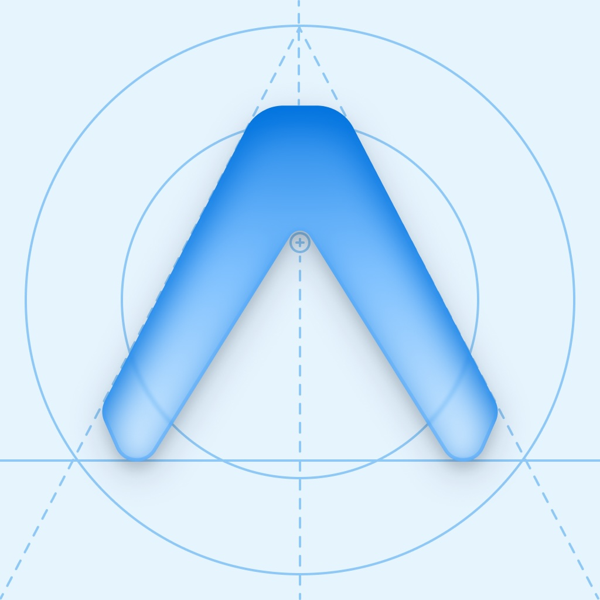
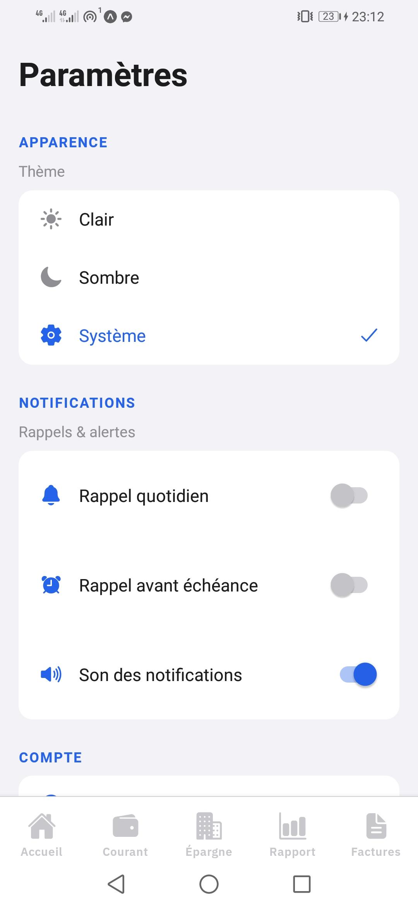
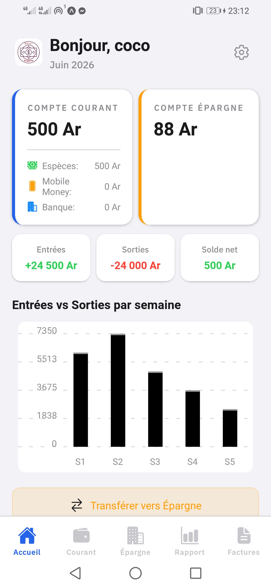
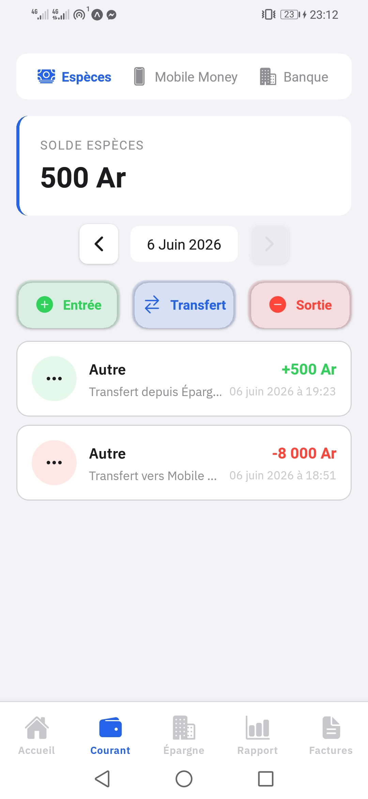
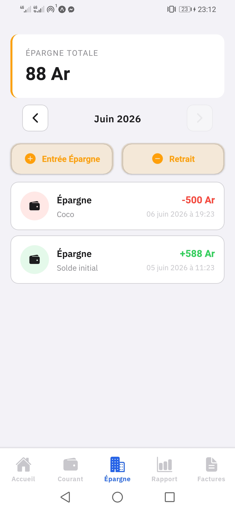
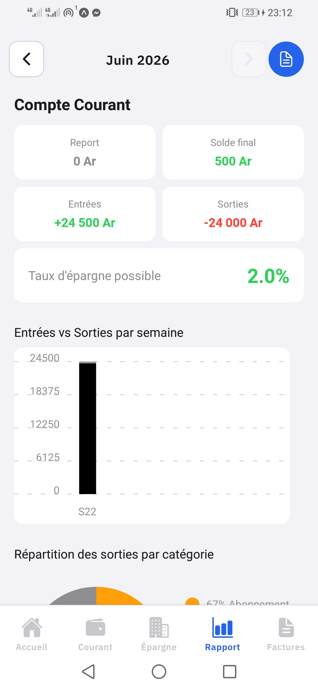
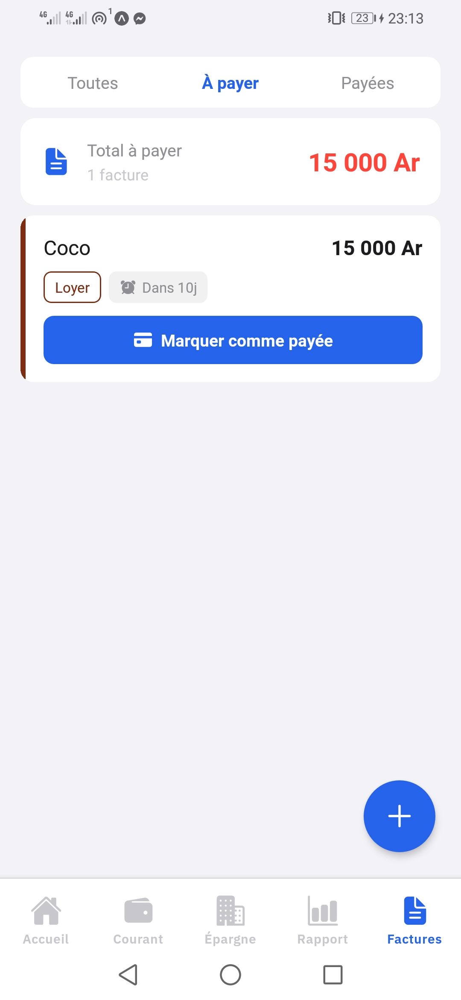
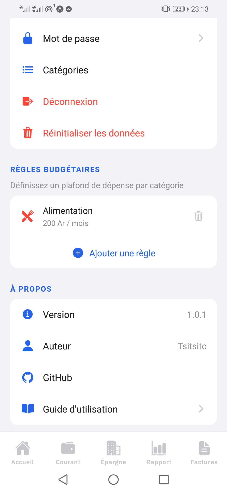

#  Mon Argent

Gestion de finances personnelles 100 % hors-ligne. Suivi multi-comptes (Espèces, Mobile Money, Banque),
épargne, factures avec notifications configurables, catégories personnalisables, graphiques analytiques
et export PDF. Devise Ariary (Ar). Police IBM Plex Sans.

## Stack Technique

| Technologie | Version | Rôle |
|---|---|---|
| Expo | SDK 54 | Framework React Native |
| Expo Router | 6 | Routage fichier |
| TypeScript | ~5.9 | Typage strict |
| expo-sqlite | 16 | Base SQLite locale (async) |
| expo-secure-store | 15 | Stockage sécurisé (sessions, thème) |
| expo-crypto | 15 | SHA-256 hash mots de passe |
| expo-notifications | 0.32 | Notifications push locales |
| expo-print | 15 | Génération PDF |
| expo-sharing | 14 | Partage/sauvegarde PDF |
| expo-updates | 29 | OTA updates (EAS) |
| expo-google-fonts | 0.4 | Police IBM Plex Sans |
| expo-linear-gradient | 15 | Dégradés UI |
| @shopify/flash-list | 2 | Liste virtuelle performante |
| react-native-chart-kit | 6 | Graphiques Bar/Pie/Line |
| react-native-reanimated | 4 | Animations natives |
| date-fns | 4 | Formatage dates (locale fr) |
| @react-native-picker/picker | 2 | Sélecteurs dropdown |
| @react-native-community/datetimepicker | 8 | Sélecteur date/time natif |

## Fonctionnalités

- **Authentification locale** — Compte unique par appareil, hash SHA-256, session persistée dans SecureStore
- **Compte Courant** — 3 wallets indépendants (Espèces / Mobile Money / Banque), CRUD transactions avec catégories et dates, navigation par jour
- **Transferts** — Entre wallets du Courant, et du Courant vers l'Épargne
- **Épargne** — Dépôts et retraits avec suivi mensuel et solde cumulé
- **Factures** — CRUD complet, filtres À payer / Payées, paiement → auto-création de dépense dans le Courant
- **Factures récurrentes** — Option mensuelle : une nouvelle facture est automatiquement créée chaque mois après paiement
- **Rapports** — Report du mois précédent, solde final, graphiques Bar/Pie/Line, top 5 dépenses, export PDF
- **Dashboard** — Soldes globaux, transactions récentes, graphique hebdomadaire
- **Catégories personnalisables** — Création / modification / suppression avec icône, couleur et type (entrée, sortie, facture)
- **Notifications** — Rappel quotidien configurable (heure au choix), rappel avant échéance (N jours), son on/off
- **Thème** — 3 modes : Clair, Sombre (OLED), Système — persisté dans SecureStore
- **Initial Setup** — Écran de configuration initiale : solde de départ pour chaque wallet + épargne
- **Compte** — Modification du nom d'utilisateur et du mot de passe
- **100 % offline** — Toutes les données en local SQLite, aucune connexion réseau requise

## Captures d'écran

<p align="center">
  
  
  
</p>
<p align="center">
  
  
</p>
<p align="center">
  
  
</p>

## Installation

```bash
git clone https://github.com/eccureuil/Mon_argent_apk.git
cd Mon_argent
npm install
```

Lancer avec Expo Go (SDK 54) :

```bash
npx expo start
```

Ou sur appareil/émulateur (dev-client) :

```bash
npm run android
npm run ios
```

## Build Android (APK)

### Prérequis

- Compte Expo (gratuit) — `npx eas login` (owner : `tsitsito`)
- EAS CLI — `npm install -g eas-cli`

### Configuration

Créer `eas.json` à la racine :

```json
{
  "cli": { "version": ">= 16.0.0" },
  "build": {
    "preview": {
      "android": { "buildType": "apk" },
      "distribution": "internal"
    },
    "production": {
      "android": { "buildType": "apk" }
    }
  }
}
```

### Lancer le build

```bash
eas build --platform android --profile preview
```

Le build dure ~10-15 min sur les serveurs Expo. Un lien de téléchargement de l'APK sera fourni.

### OTA Updates

```bash
eas update --channel preview --message "description"
eas update --channel production --message "description"
```

## Scripts disponibles

| Commande | Description |
|---|---|
| `npm start` | Démarrer Expo dev server |
| `npm run android` | Lancer sur Android (dev-client) |
| `npm run ios` | Lancer sur iOS (dev-client) |
| `npm run web` | Lancer sur navigateur |
| `npx tsc --noEmit` | Vérification TypeScript |
