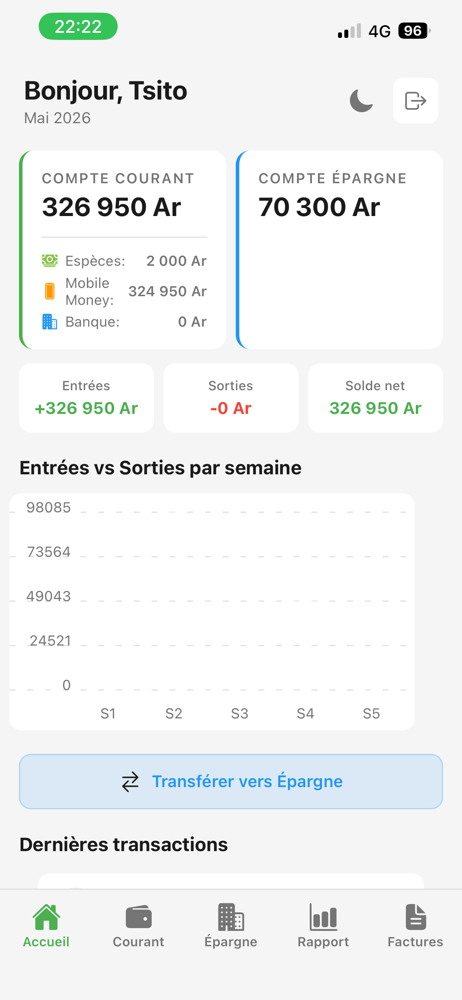
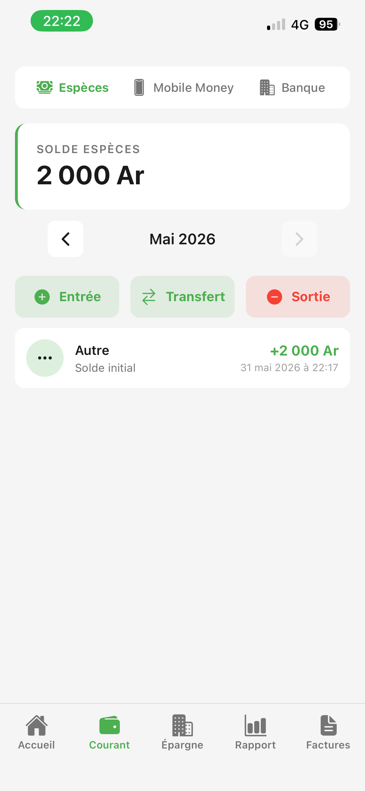
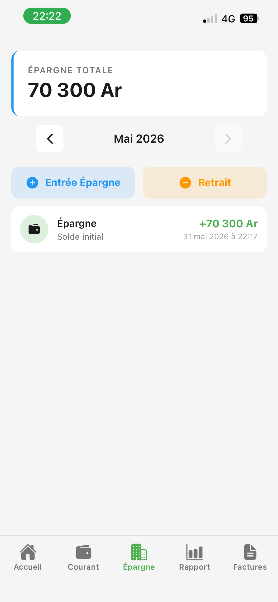
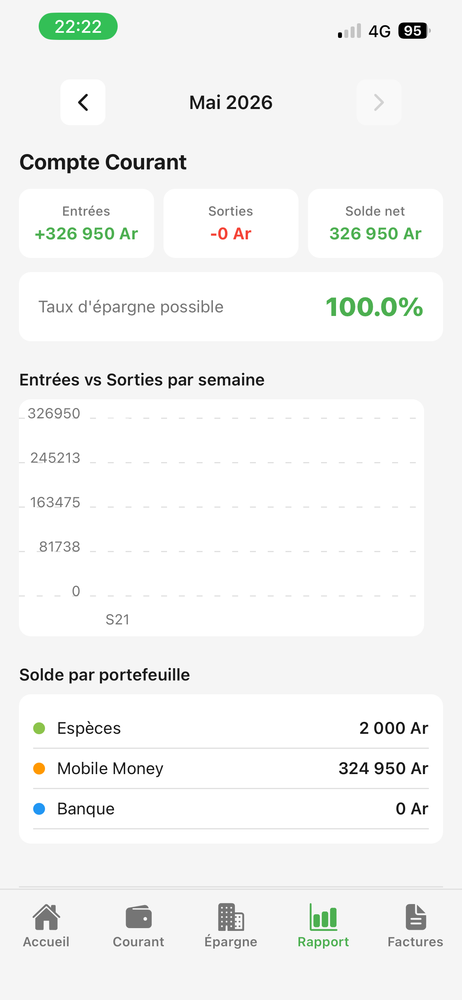
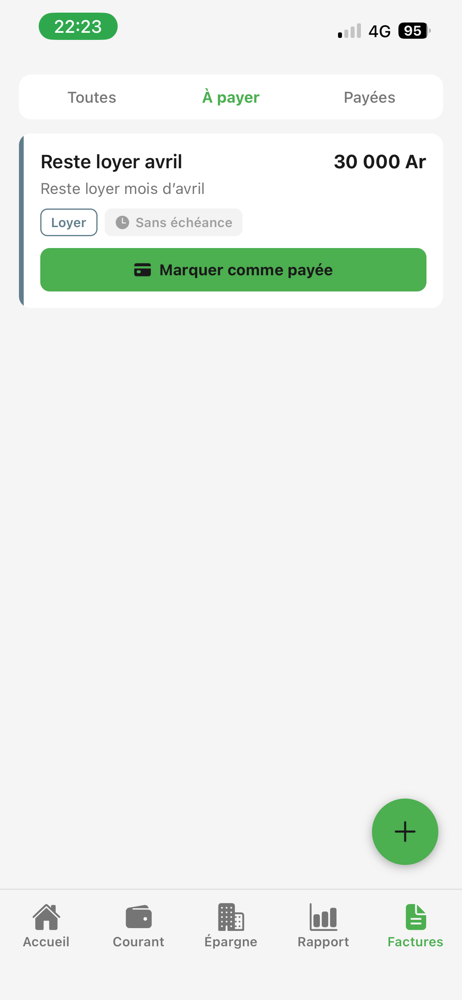

# Mon_argent 💰

Gestion de finances personnelles 100% hors-ligne. Suivi multi-comptes (Espèces, Mobile Money, Banque),
épargne, factures avec notifications, graphiques analytiques. Dark/light mode. Devise Ariary (Ar).

## Stack Technique

| Technologie | Version | Rôle |
|---|---|---|
| Expo | SDK 54 | Framework React Native |
| Expo Router | 6 | Routage fichier |
| TypeScript | 6 | Typage strict |
| expo-sqlite | 16 | Base SQLite locale (async) |
| expo-secure-store | 15 | Stockage sécurisé (sessions, thème) |
| expo-crypto | 15 | SHA-256 hash mots de passe |
| expo-notifications | 0.32 | Notifications push locales |
| expo-linear-gradient | 15 | Dégradés UI |
| @shopify/flash-list | 2 | Liste virtuelle performante |
| react-native-chart-kit | 6 | Graphiques Bar/Pie/Line |
| react-native-reanimated | 4 | Animations natives |
| date-fns | 4 | Formatage dates (locale fr) |
| @react-native-picker/picker | 2 | Sélecteurs dropdown |
| @react-native-community/datetimepicker | 8 | Sélecteur date natif |

## Fonctionnalités

- **🔐 Authentification locale** — Compte unique par appareil, hash SHA-256, session persistée dans SecureStore
- **💳 Compte Courant** — 3 wallets indépendants (Espèces / Mobile Money / Banque), CRUD transactions avec catégories et dates
- **🏦 Épargne** — Transactions d'épargne avec suivi mensuel et solde cumulé
- **📄 Factures** — CRUD complet, filtres À payer / Payées, paiement → auto-création de dépense dans le Courant
- **📊 Rapports** — Graphiques Bar (entrées/sorties par semaine), Pie (répartition par catégorie), Line (évolution épargne)
- **🏠 Dashboard** — Soldes globaux, transactions récentes, factures urgentes, transfert rapide entre wallets
- **🌓 Dark / Light mode** — Bascule manuelle (icône ☀️/🌙), persisté dans SecureStore, suit le thème système par défaut
- **🔔 Notifications** — Résumé quotidien à 19h + alertes factures en retard (vérifiées au réveil de l'app)
- **🎯 Initial Setup** — Écran de configuration initiale : solde de départ pour chaque wallet + épargne
- **📱 100% offline** — Toutes les données en local SQLite, aucune connexion réseau requise

## Captures d'écran

<p align="center">
  
  
  
</p>
<p align="center">
  
  
</p>

## Installation

```bash
git clone https://github.com/eccureuil/Mon_argent.git
cd Mon_argent
npm install
```

Lancer avec Expo Go (SDK 54) :

```bash
npx expo start
```

Ou sur émulateur :

```bash
npm run android
npm run ios
```

## Build Android (APK sideload)

### Prérequis

- Compte Expo (gratuit) — `npx eas login`
- EAS CLI — `npm install -g eas-cli`

### Configuration

Créer `eas.json` à la racine :

```json
{
  "cli": { "version": ">= 16.0.0" },
  "build": {
    "preview": {
      "android": { "buildType": "apk" },
      "distribution": "internal"
    }
  }
}
```

### Lancer le build

```bash
eas build --platform android --profile preview
```

Le build dure ~10-15 min sur les serveurs Expo. Un lien de téléchargement de l'APK sera fourni.

## Scripts disponibles

| Commande | Description |
|---|---|
| `npm start` | Démarrer Expo dev server |
| `npm run android` | Lancer sur Android |
| `npm run ios` | Lancer sur iOS |
| `npm run web` | Lancer sur navigateur |
| `npx tsc --noEmit` | Vérification TypeScript |
